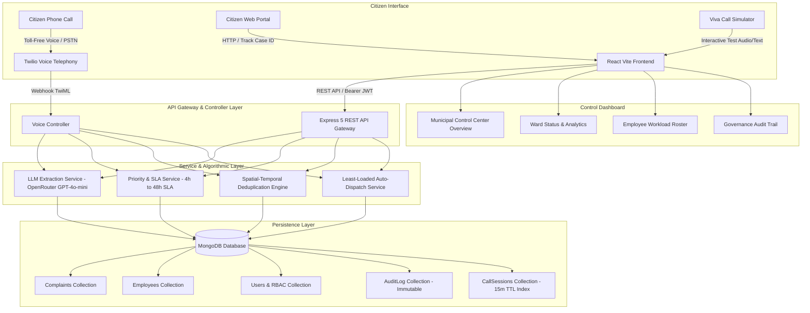
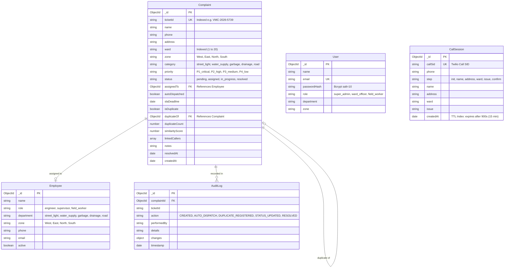

# VMC Automated AI Call Center & Civic Grievance Redressal System

> **A Major Engineering Capstone Project**  
> *Autonomous Multimodal AI Voice Telephony, Spatial-Temporal Incident Deduplication, Dynamic Load-Balanced Auto-Dispatch, and Transparent Public Citizen Tracking for Vadodara Municipal Corporation (VMC).*

---

## 📌 Abstract & Motivation

Urban local bodies in developing smart cities receive thousands of citizen complaints daily regarding critical civic disruptions—such as exposed electrical wires, burst water mains, overflowing sewage, road cave-ins, and uncollected garbage. Traditional municipal call centers suffer from severe operational bottlenecks:
1. **Operator Saturation & High Latency:** Human agents cannot scale during peak hours or monsoon crises, leading to dropped calls and unrecorded grievances.
2. **Redundant Crew Dispatch:** When a water main bursts or a transformer sparks, dozens of citizens in the same ward file independent reports. Traditional systems treat each call as an isolated event, dispatching multiple repair crews to the exact same location.
3. **Subjective Triage & SLA Breaches:** Manual ticket assignment lacks objective priority classification, allowing life-threatening hazards (e.g., exposed live cables) to languish in queues while non-urgent requests are serviced.
4. **Lack of Citizen Transparency:** Citizens are often left in the dark after calling, with no self-service mechanism to track real-time resolution progress.

**Our Solution:**  
This project presents an enterprise-grade, end-to-end Automated AI Civic Telephony and Decision Support System. It integrates:
- **Natural Voice IVR Telephony:** Conversational speech recognition with multilingual capability (Gujarati, Hindi, English) powered by Large Language Model (LLM) entity extraction.
- **Persistent Session State:** MongoDB-backed sessions with 15-minute Time-To-Live (TTL) auto-eviction to guarantee zero in-memory call drops.
- **Incident Deduplication & Clustering Engine:** N-gram Dice coefficient and token Jaccard similarity algorithms to detect duplicate reports within a 72-hour spatial-temporal window.
- **Least-Loaded Dynamic Auto-Dispatch:** Workload-balanced routing of tickets to active municipal engineers and inspectors based on department, zone, and real-time backlog.
- **Public Citizen Tracking Portal:** Clean, zero-login search interface with a 4-step visual lifecycle progress stepper and immutable audit timeline.
- **Role-Based Access Control (RBAC):** Salted bcrypt password hashing and JWT authentication for Super Admins, Ward Officers, and Field Staff.

---

## 🏛️ System Architecture



---

## 🔬 Core Algorithmic Contributions

### 1. Spatial-Temporal Incident Deduplication & Clustering
When a new complaint $C_{\text{new}} = (W, K, A, I)$ arrives for Ward $W$, Category $K$, Address $A$, and Issue $I$:
1. **Candidate Retrieval:** Filters existing unresolved tickets where $\text{ward} = W$, $\text{category} = K$, $\text{status} \neq \text{'resolved'}$, and $\text{timestamp} \ge T - 72\text{ hours}$.
2. **Text Normalization & Stopword Pruning:** Strips common locational prepositions, lowercases, and generates word token sets and character 3-grams.
3. **Similarity Metrics:**
   - **Token Jaccard Similarity:**
     $$J(I_1, I_2) = \frac{|I_1 \cap I_2|}{|I_1 \cup I_2|}$$
   - **Character 3-Gram Dice Coefficient:**
     $$D(S_1, S_2) = \frac{2 \cdot |G(S_1) \cap G(S_2)|}{|G(S_1)| + |G(S_2)|}$$
   - **Landmark & Pole Number Bonus:** Automatically matches numeric infrastructure identifiers (e.g. "pole 42").
   - **Composite Match Function:**
     $$S_{\text{composite}} = 0.55 \cdot S_{\text{address}} + 0.45 \cdot S_{\text{issue}}$$
4. **Action:** If $S_{\text{composite}} \ge 0.65$, the ticket is linked to the primary parent incident. The primary incident's `duplicateCount` increments, caller phone numbers are aggregated, and priority is automatically elevated due to citizen volume pressure.

### 2. Least-Loaded Dynamic Auto-Dispatch
To eliminate manual assignment delays, the system routes tickets using a dynamic load-balancing algorithm:
1. Resolves municipal department from grievance category (`water_supply` $\to$ Water Works, `street_light` $\to$ Electrical, etc.).
2. Gathers active municipal staff matching department and geographic zone.
3. Computes active workload $W(E_i) = \text{Count of unresolved tickets assigned to } E_i$.
4. Dispatches the grievance to employee $E^* = \arg\min_i W(E_i)$ and logs an immutable audit event.

### 3. Multi-Factor Priority Classification & SLA Escalation
- **$P_1$ Critical (SLA: 4 Hours):** Live exposed wires, transformer sparks, open manholes on roadways, gas leaks, water contamination.
- **$P_2$ High (SLA: 12 Hours):** Main water pipe bursts, sewage backflow into homes, full road blocked by fallen tree.
- **$P_3$ Medium (SLA: 24 Hours):** Single non-working streetlight, uncollected community garbage bin, road potholes.
- **$P_4$ Low (SLA: 48 Hours):** Routine garden maintenance, tree pruning, boundary whitewashing.
- **Crowd Escalation:** If an issue receives $\ge 2$ duplicate citizen reports, it auto-escalates to $P_2$. If $\ge 6$ reports accumulate, it auto-escalates to $P_1$.

---

## 🗄️ Database Schemata & ER Diagram



---

## 🚀 Quickstart & Local Setup Guide

### Prerequisites
- **Node.js:** v18+ (tested on v20 and v22)
- **MongoDB:** Local instance on `mongodb://localhost:27017` or MongoDB Atlas URI

### 1. Repository Setup
```bash
git clone git@github.com:vivek1504/minor.git vmc-civic-major
cd vmc-civic-major
```

### 2. Backend Configuration & Setup
```bash
cd backend
npm install
```

Create `backend/.env` file:
```env
PORT=3000
MONGODB_URI=mongodb://localhost:27017/vmc_civic_ai
OPENROUTER_API_KEY=your_openrouter_api_key_here
BASE_URL=http://localhost:3000
JWT_SECRET=vmc_major_project_super_secret_jwt_key_2026
```

Seed default employees and test complaints:
```bash
node seed-employees.js
node seed-complaints.js
```

Start the backend server:
```bash
npm run dev
```
*(Server will auto-seed municipal officer demo accounts and mount API routes on port 3000)*

### 3. Frontend Setup
In a separate terminal:
```bash
cd frontend
npm install
npm run dev
```
Open **http://localhost:5173** in your browser.

---

## 🧪 Automated Testing & Verification

The project includes unit, integration, and API test suites using **Jest** and **Supertest**:

```bash
cd backend
npm test
```

### Test Coverage:
- `tests/priority.test.js`: Validates keyword-based priority classification, SLA duration calculations, and duplicate report escalation logic.
- `tests/deduplication.test.js`: Validates text tokenization, character 3-gram Dice coefficients, Jaccard similarity, and landmark/pole matching.
- `tests/api.test.js`: Validates `/health`, JWT authentication rejection/acceptance, and public grievance tracking endpoints.

---

## 📖 Interactive API Documentation (Swagger / OpenAPI 3.0)

Interactive API documentation with request schemas and live testing is mounted on the backend:
- **URL:** `http://localhost:3000/api/docs` (or `http://localhost:3000/docs`)

### Key API Endpoints
| Method | Route | Description | Auth |
|---|---|---|---|
| `POST` | `/api/auth/login` | Authenticate municipal officer & return signed JWT | Public |
| `GET` | `/api/auth/me` | Fetch authenticated user profile & role | Bearer JWT |
| `GET` | `/api/complaints` | Query complaints with ward/zone/status filters | Public/Staff |
| `POST` | `/api/complaints` | Ingest complaint (Triggers Deduplication & Auto-Dispatch) | Public/Staff |
| `GET` | `/api/complaints/:id` | Get complaint details with child duplicates | Public/Staff |
| `PATCH` | `/api/complaints/:id` | Update status, assign staff, add notes | Staff |
| `GET` | `/api/complaints/track/:query` | Public tracking by Ticket ID or Phone | Public |
| `POST` | `/api/simulator/preset` | 1-Click preset IVR call simulation for viva | Public |
| `POST` | `/api/simulator/turn` | Turn-by-turn conversational audio simulation | Public |
| `GET` | `/api/audit-logs` | Immutable audit trail with timestamp and diffs | Public/Staff |
| `GET` | `/api/employees` | Active municipal workforce roster | Public/Staff |
| `POST` | `/api/voice` | Twilio incoming PSTN telephony webhook | Telephony |

---

## 🔐 Default Demo Accounts (For Viva Presentation)

The system automatically initializes 3 municipal officer roles for evaluation:

| Role | Email | Password | Access Scope |
|---|---|---|---|
| **Super Admin (Commissioner)** | `admin@vmc.gov.in` | `Admin@123` | Full administrative control across all 20 wards and departments |
| **Ward Officer (West Zone)** | `ward.west@vmc.gov.in` | `Officer@123` | Ward monitoring, engineer dispatch, and status verification |
| **Field Inspector (North Zone)** | `field.patel@vmc.gov.in` | `Field@123` | On-site updates, resolution notes, and closure confirmation |

*(Click **"Officer Sign In"** on the dashboard header for 1-click demo login buttons).*

---

## 🎓 Viva Defense & Examination Demonstration Guide

When demonstrating this project to external examiners:

1. **Step 1: The Citizen Voice Call Simulation**
   - Click the **"Test Call Simulator"** button in the top navigation bar.
   - Select the **"Broken Street Light (Ward 12)"** preset.
   - Click **"Simulate Citizen Call"**.
   - Show how the system ingests noisy speech (`"maru naam Chetan Parmar che, akota ma tube well pole 42 pase street light sparking thay che"`), extracts clean structured JSON, infers Ward 12, West Zone, and auto-classifies it as `P1_critical` (SLA: 4 hours) due to live wire sparking.
   - Point out that the system auto-dispatched the ticket to **Ramesh Patel** (Electrical Engineer, West Zone) because he had the lowest active workload!

2. **Step 2: Proving Incident Deduplication & Clustering**
   - Run the simulation a second time with the same scenario or submit another complaint for Ward 12 near tube well pole 42.
   - Show that the system detects a **100% duplicate match**!
   - Highlight that instead of dispatching a second repair team, the system linked it to the primary ticket, incremented `duplicateCount`, and attached the caller's phone number.

3. **Step 3: Public Citizen Transparency Portal**
   - Navigate to the **"Citizen Portal"** in the sidebar.
   - Search for `#VMC-2026-5739` or enter phone `+919876543210`.
   - Walk through the visual 4-step lifecycle stepper: `Registered` ➔ `Assigned` ➔ `Field Work` ➔ `Resolved`, and show the live immutable audit timeline.

4. **Step 4: Governance Audit Trail & Security**
   - Navigate to the **"Audit Log"** page in the sidebar.
   - Show how every action (`CREATED_AND_DISPATCHED`, `DUPLICATE_REPORT_LINKED`, `STATUS_UPDATED`) records an immutable cryptographic timestamp and user badge.

---

## 🛠️ Technology Stack

- **Backend:** Node.js, Express 5, Mongoose (MongoDB ODM), Twilio SDK, Axios, Bcrypt.js, JsonWebToken, Swagger UI Express.
- **Frontend:** React 19, TypeScript, Vite, Tailwind CSS, Heroicons.
- **AI & NLP:** OpenRouter API / OpenAI GPT-4o-mini with multi-turn prompt engineering and Gujarati-English phonetic transliteration handling.
- **Testing:** Jest, Supertest.

---

## 📄 License & Attribution

Developed as a Major Engineering Capstone Project for **Vadodara Municipal Corporation (VMC)** civic grievance automation.  
Licensed under the **ISC License**.
